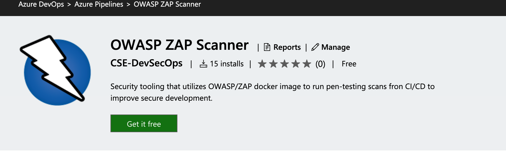
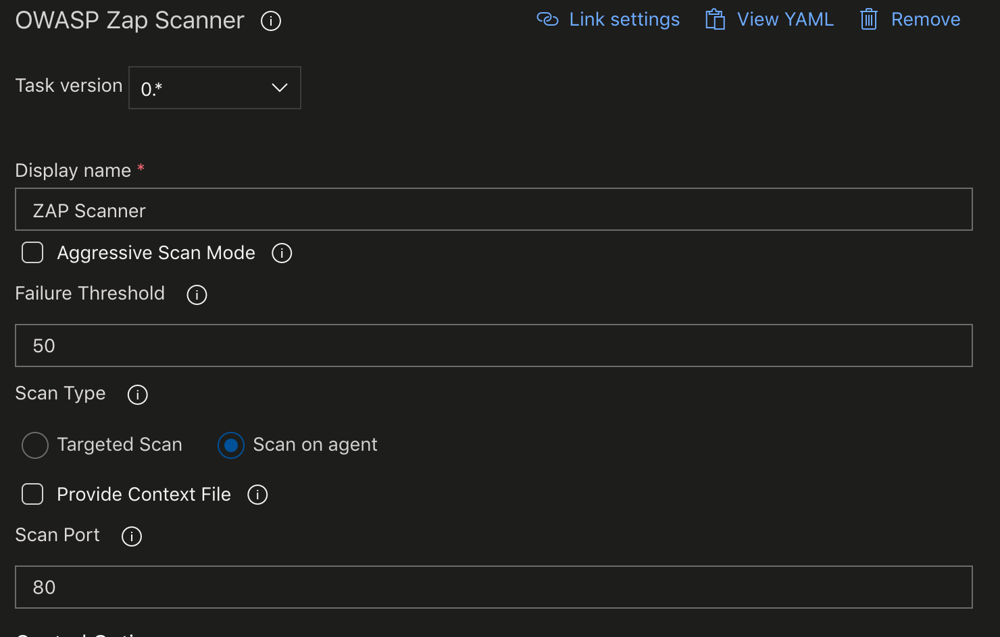
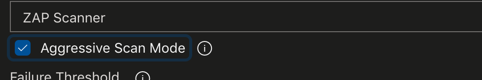
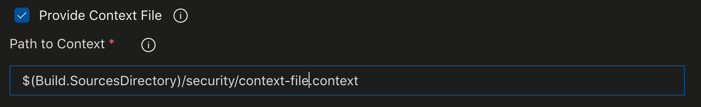

# OWASP/ZAP Scanning extension for Azure Devops

[OWASP/ZAP](https://www.owasp.org/index.php/OWASP_Zed_Attack_Proxy_Project) is a popular free security tool for helping to identitfy vulnerabilites during the development process from [OWASP](https://www.owasp.org). This extension shifts scanning and reporting into the Azure DevOps Pipeline model in order to enable quick feedback and response from developmemt teams throughout the development life-cycle. 

## Usage

### Prerequisite

This task simplifies shifting security scanning of web applicaitons into the DevOps pipeline in part by removing the requirement of having a running, exposed ZAP proxy before attempting the scan. By installing the proxy you are enabling self-contained scans within your CI/CD pipeline. The core requirement for usage is a Docker install available to this task.

### Configuration

After installing the scanner from the Azure DevOps Marketplace you will need to add the scanner to your agent job and configure a few basic requirements.

- The "Display name" of the task can be left as-is, or it can by updated to better fit withing naming conventaions of your pipeline.

- By default the task will run a baseline scan.

> The baseline scan will spider the target for 1 minute and then wait for the passive scanning to complete. This makes for a relatively short-running scan that doesn't perform any attacks.

> A full-scan can be ran by ticking the "Agressive Scan Mode" checkbox. This scan doesn't have a time-limit and does perform 'attacks'. It can run for a long period of time. Not ideally suited for CI, but is a useful tool for release-gates. 

- The "Failure Threshold" indicates the score for which the pipeline will begin to fail. The scoring mechanism built into this scanner is meant to be suggestive and security personnell knowledgable about threat-models for the specific applicaiton should be engaged to appriately adjust this value. The default of 50 is not meant to be suggistive as correct.

- By default that "Scan Type" used is "Scan on Agent". This type of scan is very useful in pipelines for containerized applications. **This usage requires a preceeding step to build your iamge and run it (detached) within the agent.**

- When running a full-scan in release-pipelines, or if your applicaiton is not containerized and has to be ran in a VM "Scan Type" can be changed to "Targeted Scan". In this case you are required to provide the schema and address for your target. Ex. https://10.20.10.40 or http://myWebSite.net.

> - By default the scan will be performed without much effort at scoping for tech, excluded url endpoints, etc.., but you can provide a context file for a more focused scan. This is useful to take full advantage of the baseline scans minute of crawling or to narrow the scope of a full-scan in agressive mode to keep the duration as short as possible. To accomplish this check "Provide Context File" box and provide the path to a context file in your source repository relative to the build copy of source. 

- Finally, an optional port number can be supplied. By default the scan will be interested in port 80 on the target system. If another port is used then the "Scan Port" must be updated to reflect the correct port.
